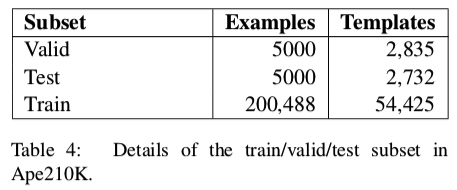
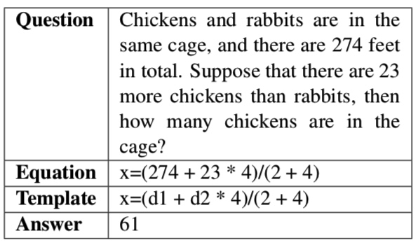

# Ape210K
## Introduction
We open source the Ape210K dataset and our baseline model in this repository.

## The Ape210K Dataset
Ape210K is a large-scale and template-rich math word problem (MWP) dataset.
Ape210K contains 210,488 problems and 56,532 templates.
We split the whole dataset into train/valid/test.

### An Example of the Math Word Problems
Here is an example of the math word problems.

Here illustrate an example of the math word problems, including the question text description, the equation, the equation template, and the final answer. In this example, the given numbers are "274 feet in total" and "23 more chickens than rabbits", and the unknown variable x refers to "the number of chickens in the cage". Solving this problem needs basic arithmetic knowledge and common sense that "a chicken has 2 legs, and a rabbit has 4 legs".

## What's in this repository?
#### The Ape210 Datasets
- [Train Dataset (200,288 problems)](data/train.ape.json)
- [Valid Dataset (5,000 problems)](data/valid.ape.json)
- [Test Dataset (5,000 problems)](data/test.ape.json)

#### Our Feature-riched and Copy-augmented Sequence to Sequence Model
- [Source Code (Acc: 70%)](onmt)

## Acknowledgements
Our code was modified from OpenNMT-py code base. We use the same license as OpenNMT-py.

